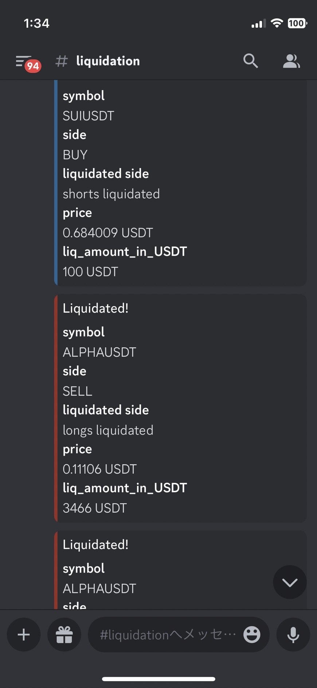
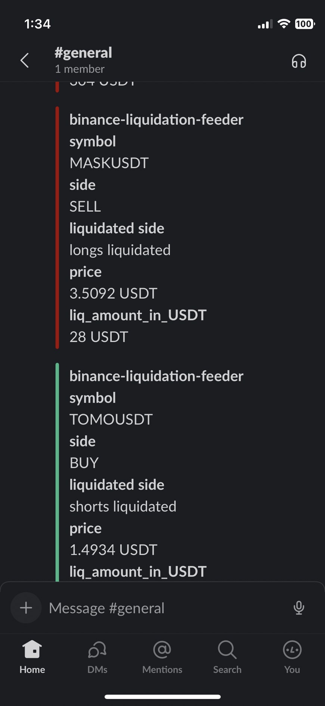

[](https://www.python.org/downloads/release/python-3110//)
# binance-liquidation-feeder
Notify liquidation on Binance.

# Installation
```shell
pip install git+https://github.com/aoki-h-jp/binance-liquidation-feeder
```

# How to use

```python
from binance_liquidation_feeder import BinanceLiquidationFeeder

liq = BinanceLiquidationFeeder()
liq.ws.run_forever()
```

## Notify to Discord or Slack
```python 
from binance_liquidation_feeder import BinanceLiquidationFeeder

liq = BinanceLiquidationFeeder(discord_webhook_url="https://discord.com/api/webhooks/...", slack_webhook_url="https://hooks.slack.com/services/...")
liq.ws.run_forever()
```

# Sample



